# AgentLens

> Multi-Agent Coding Assistant with GPU Inference Visibility

Watch AI agents collaborate on coding tasks while seeing real-time GPU inference metrics, token generation, and reasoning traces.


## The Problem

AI agents are black boxes. When you run CrewAI, AutoGen, or LangGraph agents:
- You don't know which agent is "thinking"
- You can't see why it made a decision
- You have no visibility into GPU usage per agent
- Debugging multi-agent failures is painful

## What AgentLens Does

1. **Multi-agent coding assistant**: Give it a task, watch 4 specialized agents collaborate
2. **Real-time visualization**: See each agent's token stream and reasoning AS they happen
3. **GPU inference dashboard**: Live metrics per agent—tokens/sec, VRAM, latency
4. **Transparent reasoning**: Click any agent output to see the full context

## Architecture

```mermaid
flowchart TB
    subgraph Dashboard["VISUALIZATION DASHBOARD"]
        A1["🏗️ Architect Agent<br/>GPU: 45%"]
        A2["💻 Coder Agent<br/>GPU: 78%"]
        A3["🔍 Reviewer Agent<br/>GPU: 12%"]
        A4["▶️ Executor Agent<br/>GPU: 0%"]
    end
    
    Dashboard --> Orchestrator["AGENT ORCHESTRATOR<br/>(LangGraph)"]
    Orchestrator --> Inference["INFERENCE ENGINE<br/>(vLLM + Llama-3-8B)"]
    Inference --> Metrics["METRICS COLLECTOR<br/>(Prometheus)"]
    Metrics -.-> Dashboard
```



## Quick Start

### Option 1: Docker (Recommended)

**Prerequisites:** Docker Desktop

```bash
git clone https://github.com/elvin-rivera23/agent-lens.git
cd agent-lens
docker compose --profile cpu up
```

> ⏱ **First run**: ~5-10 min to download TinyLlama model (~700MB).

Open http://localhost:3000 and enter a coding task!

---

### Option 2: Local Development (Ollama)

**Prerequisites:** Python 3.11+, Node.js 18+, [Ollama](https://ollama.com/download)

```bash
# 1. Clone & install
git clone https://github.com/elvin-rivera23/agent-lens.git
cd agent-lens

# 2. Pull the model (~700MB)
ollama pull tinyllama

# 3. Start orchestrator
cd services/orchestrator
pip install -r requirements.txt
$env:INFERENCE_URL='http://localhost:11434'
$env:WORKSPACE_DIR='./workspace'
cd src && python -m uvicorn main:app --port 8001 --reload

# 4. Start dashboard (new terminal)
cd services/dashboard
npm install && npm run dev
```

Open http://localhost:5173 and enter a coding task!

## Requirements

- **Docker Mode**: Docker Desktop
- **Local Mode**: Python 3.11+, Node.js 18+, Ollama

## Features

| Feature | Description |
|---------|-------------|
| 🤖 **4-Agent Pipeline** | Architect → Coder → Reviewer → Executor with automatic retry |
| 👁️ **Glass-Box Visibility** | See every agent's reasoning, tokens, and decisions in real-time |
| 📊 **GPU Telemetry** | Live utilization gauges, VRAM tracking, TPS sparklines |
| ⚡ **Streaming Output** | Watch code generate token-by-token via WebSocket |
| 🔄 **Error Recovery** | Automatic retry with error classification and fix prompts |
| 🎨 **Cyberpunk HUD** | Dark theme dashboard with agent timeline and reasoning drawer |

## Documentation

- **[API Reference](docs/API.md)** - REST endpoints and WebSocket events
- **[Configuration](docs/CONFIGURATION.md)** - Environment variables and Docker profiles

## Project Structure

```
agent-lens/
├── services/
│   ├── inference/        # vLLM server
│   ├── orchestrator/     # LangGraph agents
│   ├── metrics/          # GPU metrics collector
│   ├── dashboard/        # React frontend
│   └── codebase-index/   # pgvector + embeddings
├── agents/               # Agent definitions
├── dashboards/           # Grafana JSON
├── scripts/              # Utility scripts
└── docs/                 # Documentation
```

## Benchmarks

| Model | Quantization | VRAM | Tokens/sec | Latency p50 |
|-------|--------------|------|------------|-------------|
| Llama-3-8B | Q8 | ~10GB | ~50 | 180ms |
| Llama-3-8B | Q4 | ~6GB | ~65 | 140ms |
| Phi-3-mini | Q4 | ~4GB | ~80 | 100ms |

*Benchmarks measured on RTX 4080 Super*

## License

MIT
