# AgentLens

> Multi-Agent Coding Assistant with GPU Inference Visibility

Watch AI agents collaborate on coding tasks while seeing real-time GPU inference metrics, token generation, and reasoning traces.


## The Problem

AI agents are black boxes. When you run CrewAI, AutoGen, or LangGraph agents:
- You don't know which agent is "thinking"
- You can't see why it made a decision
- You have no visibility into GPU usage per agent
- Debugging multi-agent failures is painful

## What AgentLens Does

1. **Multi-agent coding assistant**: Give it a task, watch 4 specialized agents collaborate
2. **Real-time visualization**: See each agent's token stream and reasoning AS they happen
3. **GPU inference dashboard**: Live metrics per agent—tokens/sec, VRAM, latency
4. **Transparent reasoning**: Click any agent output to see the full context

## Architecture

```mermaid
flowchart TB
    subgraph Dashboard["VISUALIZATION DASHBOARD"]
        A1["🏗️ Architect Agent<br/>GPU: 45%"]
        A2["💻 Coder Agent<br/>GPU: 78%"]
        A3["🔍 Reviewer Agent<br/>GPU: 12%"]
        A4["▶️ Executor Agent<br/>GPU: 0%"]
    end
    
    Dashboard --> Orchestrator["AGENT ORCHESTRATOR<br/>(LangGraph)"]
    Orchestrator --> Inference["INFERENCE ENGINE<br/>(vLLM + Llama-3-8B)"]
    Inference --> Metrics["METRICS COLLECTOR<br/>(Prometheus)"]
    Metrics -.-> Dashboard
```



## Quick Start

### GPU Mode (Windows/Linux with NVIDIA GPU)

```bash
docker compose --profile gpu up -d
```

### CPU Mode (Mac M1 / No GPU)

```bash
docker compose --profile cpu up -d
```

### Open Dashboard

```
http://localhost:3000
```

## Requirements

- Docker + Docker Compose
- **GPU Mode**: NVIDIA GPU with 12GB+ VRAM, NVIDIA Container Toolkit
- **CPU Mode**: 16GB+ RAM

## Project Structure

```
agent-lens/
├── services/
│   ├── inference/        # vLLM server
│   ├── orchestrator/     # LangGraph agents
│   ├── metrics/          # GPU metrics collector
│   ├── dashboard/        # React frontend
│   └── codebase-index/   # pgvector + embeddings
├── agents/               # Agent definitions
├── dashboards/           # Grafana JSON
├── scripts/              # Utility scripts
└── docs/                 # Documentation
```

## Benchmarks

| Model | Quantization | VRAM | Tokens/sec | Latency p50 |
|-------|--------------|------|------------|-------------|
| Llama-3-8B | Q8 | ~10GB | ~50 | 180ms |
| Llama-3-8B | Q4 | ~6GB | ~65 | 140ms |
| Phi-3-mini | Q4 | ~4GB | ~80 | 100ms |

*Benchmarks measured on RTX 4080 Super*

## License

MIT
